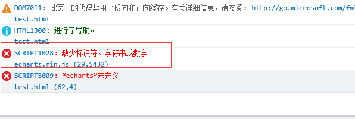
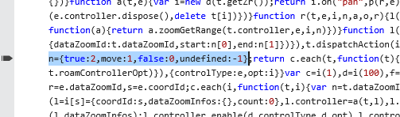
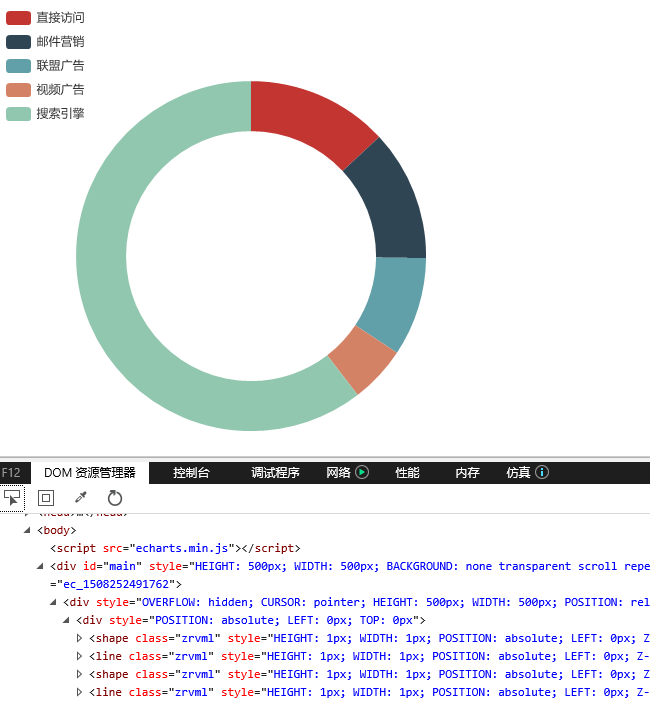

## Echarts 3.7.2版本关于支持IE8 的修改

###### 点击[这里下载][1]修改过后的Echarts3.7.2的版本

Echarts 3.7.2版本刚刚正式发布的时候，QQ群里面好多反馈在IE8浏览器中使用echarts.min.js 会报错，我也亲自试了一下，是有报错的.
截图如下：

 

我们点击报错的提示，浏览器会定位报错的位置，截图如下：

 

根据图中我发现 ``n={true:2, monve: 1, false: 0, undefined: 1};``导致的，
我们只需改成``n={'true':2, 'monve': 1, 'false': 0, 'undefined': 1};``。

改为之后，我们在预览页面，正常展示，截图如下：

 

改成这样的原因是：

**因为``true false undefined``这几个是js的关键字。IE8下的js引擎会将属性名为保留关键字的作为关键字处理**

Echarts在IE8采用VML渲染的，所以要兼容IE8的，Echarts以下功能无法使用

* **新增的富文本``rich``无效**

* **渐变颜色无效**

* **无法下载图片**

* **引入图片无效，例如：``symbol: 'image://https://pic3.zhimg.com/50/fe5f2bdd0e9411914e902c706f665832_hd.jpg'``**

###### **点击[这里下载][1]修改过后的Echarts3.7.2的版本**

[1]: https://github.com/liqingzheng/pc/blob/master/echartsV3.7.2.min.js
